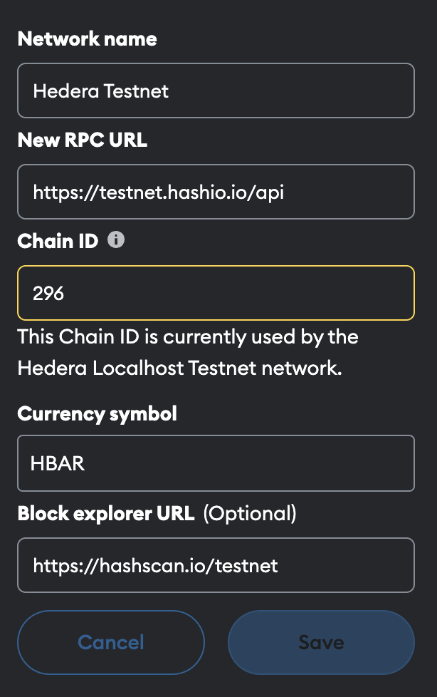
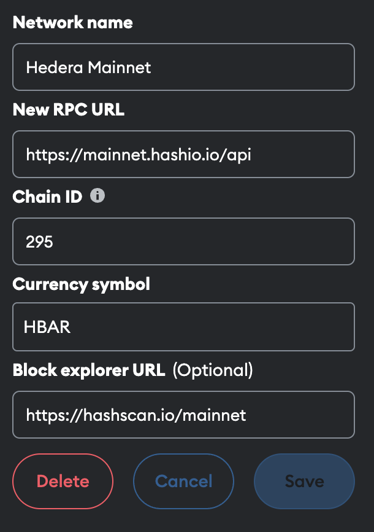
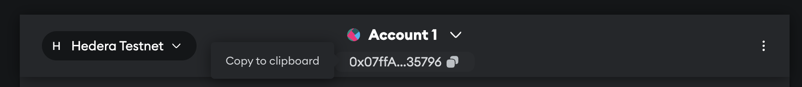

# ***Introduction***

# What is Hedera

## EVM Compatible

Hedera is a layer 1 EVM-compatible blockchain network. It supports smart contracts just like Ethereum does, and also offers several additional native services. All the EVM developer tools, frameworks, and libraries work out of the box, and only minimal config changes are needed.

Read more about [Hedera for EVM Developers](https://docs.hedera.com/hedera/core-concepts/smart-contracts/hederas-evm-equivalence-goals-and-exceptions).

## Hashgraph Consensus

The secret sauce behind the Hedera network is its consensus algorithm, which is [DAG-based](https://en.wikipedia.org/wiki/Directed_acyclic_graph). It also means that instead of probabilistic transaction finality, Hedera has deterministic transaction finality.

## Public permissioned network

Hedera is a public permissioned network, where members of the [Hedera governing council](https://hedera.com/council) run the consensus nodes that operate the public network. Members of the governing council have fixed terms and elect the next members.

# Why build on Hedera

## Technology choice

The Hedera network offers SDKs in multiple languages. If you are already familiar with languages such as Javascript/Typescript, Java, or Go, you are in luck. You can write code that interacts with the network using our SDKs without the need to learn any new languages.

Read more about [Hedera SDKs](https://docs.hedera.com/hedera/sdks-and-apis/sdks#hedera-services-code-sdks).

For example, you can create fungible tokens and non-fungible tokens without smart contracts, using the SDK methods for Hedera Token Service (HTS). You can also create message queues with pub-sub features out of the box via Hedera Consensus Service (HCS). And of course, you can create smart contracts for everything else using Solidity via the Hedera Smart contract Service (HSCS).

## Other reasons

With Hedera, you get all of the benefits of web3 technology including decentralisation and immutability, just like you would with any other blockchain network.

Over and above that, you would also get Hedera-specific benefits:

- Stable fees per transaction: Prices are fixed in USD, and paid in variable amounts of cryptocurrency (HBAR).
- High performance: Hedera averages 1,500 tx/s, and peaks up to 10,000 tx/s.
- Deterministic finality: Transactions added to the blockchain are immediately final; there is no need to wait for a certain number of child blocks to be added before being sure that the transaction has been confirmed.
- Fair transaction ordering: Transactions cannot be front-run, back-run, or sandwiched, since transactions are not grouped into blocks prior to consensus in Hashgraph.

- Read more about Maximal Extractable Value (MEV) - [Chainlink](https://chain.link/education-hub/maximal-extractable-value-mev)
- See also: The Hashgraph>Consensus>Blocks section below

- Many interesting use cases are possible: Go further than what’s possible with smart contracts alone!

- See also: The Hedera Services section below

# Connecting to Hedera

## Use familiar EVM dev tools and workflows

Hedera’s keys and signatures are a superset of what is supported by EVM. It supports both ECDSA secp256k1 keys (same as EVM) and EdDSA Ed25519 keys (not used in EVM).

See more at [Hedera Keys and Signatures](https://docs.hedera.com/hedera/core-concepts/keys-and-signatures).

EVM bytecode is supported on Hedera in HSCS. In fact under the hood, Hedera nodes run `org.hyperledger.besu.evm` (the Hyperledger Besu EVM implementation). You may check the EVM version in [the dependencies used by the Hedera nodes](https://github.com/hashgraph/hedera-services/blob/develop/hedera-dependency-versions/build.gradle.kts). This means that you can write Solidity code, compile it using `solc`, and deploy that to Hedera, just as you would on Ethereum.

Hedera also exposes JSON-RPC endpoints via its RPC relay, which proxies between Hedera nodes and JSON-RPC clients. See [RPC API](https://github.com/hashgraph/hedera-json-rpc-relay/blob/main/docs/rpc-api.md) for more details.

See also: [Hedera’s EVM equivalence goals and exceptions](https://docs.hedera.com/hedera/core-concepts/smart-contracts/hederas-evm-equivalence-goals-and-exceptions).

EVM developer tools, frameworks, and libraries are all supported.

- Hardhat
- Foundry
- EthersJs
- Viem
- ERC20/ ERC721 token standards

EVM developer workflows are also supported

- MetaMask
- Faucets
- Block explorers
- Smart contract verification

The [Hedera Hackathon Cheat Sheet](https://github.com/hedera-dev/hedera-cheatsheets/blob/master/hedera-hackathon-starter-cheat-sheet-v1.pdf) contains detailed links for all of the above.        

## Try it out

Run the following command in your terminal, to issue a JSON-RPC request.

```shell
curl -s https://testnet.hashio.io/api \
  -X POST \
  -H "Content-Type: application/json" \
  --data '{"method":"eth_getBlockByNumber","params":["latest",false],"id":1,"jsonrpc":"2.0"}'

```

This obtains the block number from Hedera Testnet.

Repeat the same command 2 seconds later, and observe that the block number has increased.

Hedera also supports another means to query the network state, which is via its Mirror Node APIs.

Run the following command in your terminal:

```shell

curl -s "https://testnet.mirrornode.hedera.com/api/v1/blocks?limit=1&order=desc"

```

Here too, repeat the same command 2 seconds later, and observe that the block number has increased.

## Fund an account

Open MetaMask, and connect to Hedera Testnet. The easiest way to do so is:

- Open the MetaMask browser plugin by clicking on its logo
- Click on the vertical ellipses (“⋮”) to open a dropdown menu
- Select “Expand view”
- This should open up a new tab, and the URL in the address bar should be:
    `chrome-extension://nkbihfbeogaeaoehlefnkodbefgpgknn/home.html#`
- Click on the vertical ellipses (“⋮”) here to open a dropdown menu
    `chrome-extension://nkbihfbeogaeaoehlefnkodbefgpgknn/home.html#settings/networks`
- Select “Settings”
- On the left column, select “Networks”
- Press the “Add a network” button
- Input the following:

- Network name: `Hedera Testnet`
- RPC URL: [`https://testnet.hashio.io/api`](https://testnet.hashio.io/api)
- Chain ID: `296`
- Currency symbol: `HBAR`
- Block explorer URL: [`https://hashscan.io/testnet`](https://hashscan.io/testnet)


Your MetaMask config for Hedera Testnet should look like this.

Note that the RPC URL that you use should be swapped out for localhost or any other RPC provider as appropriate.

 

FYI this is what the Hedera Mainnet config should look like. However, you will not need this for the tutorial.




Copy the EVM address of one of your MetaMask accounts. This should start with `0x`. In MetaMask, you can use the copy icon next to the address.



Then visit [faucet.hedera.com](https://faucet.hedera.com/). Paste your EVM address in the form, and submit. After about 2 seconds, you will have Testnet HBAR in your EVM account on Hedera. You can now use this account as you normally would in MetaMask. More importantly, for this guide, you can use this account to fund transactions that you’ll use to build on + interact with the Hedera network.

## Running on localhost

While you cannot run your own Hedera node connected to a public network on your computer (it is a public permissioned network), you can run your own RPC relay. Follow the instructions at [Configuring Hedera JSON-RPC Relay endpoints](https://docs.hedera.com/hedera/tutorials/more-tutorials/json-rpc-connections/hedera-json-rpc-relay).

Alternatively, you can indeed run your own Hedera network on your computer, but this network would not be a public network, it is a local Hedera network. To do so, you can use either Hedera Local Node or Hedera Solo. Read more about this at [Localnet](https://docs.hedera.com/hedera/networks/localnet).
