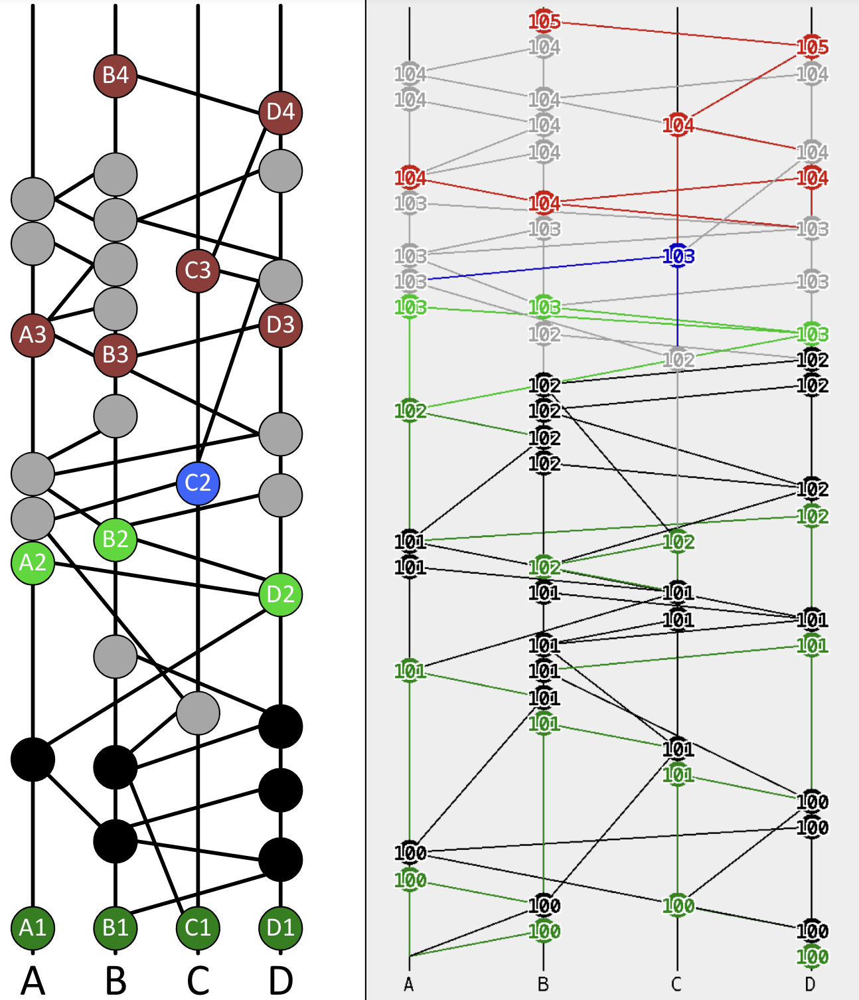
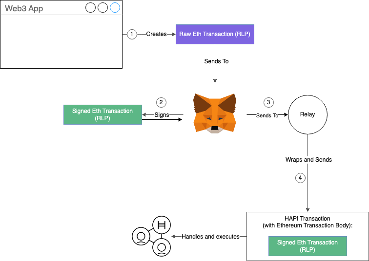

# ***Hedera Technology***

# Hashgraph

## Consensus

[](https://www.youtube.com/watch?v=cje1vuVKhwY)

▶️ [https://www.youtube.com/watch?v=cje1vuVKhwY](https://www.youtube.com/watch?v%3Dcje1vuVKhwY)

The consensus algorithm needs to do two key things:

- Ensure that all transactions are valid, allow valid transactions to be added to the network, and discard invalid transactions.
- Ensure that the transactions which are added to the network are fairly ordered.

The first is fairly straightforward, and is accomplished through the use of public key cryptography to sign transactions, and verify signatures.

The latter, on the other hand, is an extremely hard problem to solve, and Hashgraph’s solution is different from other blockchains. The primary mechanisms through which Hashgraph accomplishes this are gossip about gossip, and virtual voting.

Gossip about gossip is where transactions are grouped into events, and events are related to each other through the hashes of their parent events. When visualised, this forms a directed acyclic graph of hashes (hence the name, Hashgraph). These hashes are propagated throughout the nodes using gossip algorithms.

Virtual voting is where nodes vote on the order of the transactions without the need to propagate their votes to other nodes in the network, saving bandwidth. Instead, they simply determine order based on their own view of the Hashgraph stored locally.



Read more in the [original Swirlds tech report (2016)](https://www.swirlds.com/downloads/SWIRLDS-TR-2016-01.pdf).

## Blocks

The above consensus algorithm looks fundamentally different from that of a standard blockchain. So, is Hedera still a blockchain? Yes - Hedera is both.
The consensus algorithm (Hashgraph) does not use blocks as inputs. However, it does generate blocks as outputs, after consensus has been achieved.

Read more about pre-consensus blocks and post-consensus blocks at [Hedera: Blockchain or Not?](https://blog.bguiz.com/2024/hedera-blockchain-or-not/)

Hedera serialises the state of transactions that have achieved consensus every 2 seconds into a record file. This series of record files forms the blockchain. This is crucial for EVM compatibility on Hedera, as the JSON-RPC protocol, as well as EVM bytecode (and by extension languages that have EVM bytecode as a compile target, including Solidity), both assume the presence of blocks. For example, the `eth_getBlockByNumber` RPC, and the `block` built-in variables in Solidity.

# Talking to Hedera

In order to understand the various Hedera Services, we must first know the various ways in which we can interact with the Hedera network. There are 3 primary communications protocols available:

|   |   |   |   |
|---|---|---|---|
||Protocol|Format|Tools/ libraries|
|Hedera APIs|gRPC|protocol buffers|Hedera SDK|
|Mirror Node APIs|HTTP|JSON|curl, fetch, …|
|JSON-RPC|HTTP|JSON (Ethereum RPC)|MetaMask, ethers.js, hardhat, …|

# Hedera Services

## HSCS

Hedera Smart Contract Service (HSCS) allows you to deploy and interact with smart contracts. These smart contracts are EVM smart contracts, and thus the same EVM bytecode would run on Hedera as it would on Ethereum. This is thanks to Hedera's use of the Hyperledger Besu EVM implementation under the hood.

Read more: [Hedera Smart Contracts Workshop](https://docs.hedera.com/hedera/tutorials/smart-contracts/hscs-workshop).

Note that in the “Let’s Build!” section below, we will write a contract in Solidity, compile it using `solc`, deploy that on Hedera Testnet, and use viem to write a DApp that interacts with the deployed smart contract on HSCS.

## HTS

Hedera Token Service (HTS) allows you to create and manage both fungible tokens (analogous to ERC20 tokens) and non-fungible tokens (analogous to ERC721 tokens).

HTS tokens even come with built-in features such as admin, treasury, KYC, supply, freeze, pause, wipe, custom fees (e.g. royalties), which would be very complex to implement using smart contracts. Note that HTS tokens are natively built into Hedera protocol, and do not require custom smart contracts like ECR20/ ERC721 on Ethereum.

As with all Hedera services, you can do so using any programming language with a Hedera SDK. For example, to create a new fungible token in Javascript, the code is as straightforward as:

```js
await new TokenCreateTransaction()
     .setTokenName("Your Token Name")
     .setTokenSymbol("FT")
     .setTreasuryAccountId(treasuryAccountId)
     .setInitialSupply(5000)
     .setAdminKey(adminPublicKey)
     .setMetadataKey(metadataKey)
     .setMetadata(metadata)
     .setMaxTransactionFee(new Hbar(30))
     .freezeWith(client);

```

Read more: [Create a token](https://docs.hedera.com/hedera/sdks-and-apis/sdks/token-service/define-a-token).

What is interesting is that HTS tokens created like this may be interacted with not only using Hedera SDK methods, but also with EVM methods. For example, to interact with an HTS fungible token, you can use its EVM address plus the ERC20 ABI; and similarly to interact with an HTS non-fungible token, you can use its EVM address plus the ERC721 ABI. HTS will translate/ proxy the EVM transactions into native HTS transactions.

One thing to be aware of is that HTS tokens have an additional concept not present in ERC20/ ERC721 called “token association”

Read more: [Associate tokens to an account](https://docs.hedera.com/hedera/sdks-and-apis/sdks/token-service/associate-tokens-to-an-account).

## HCS

Hedera Consensus Service (HCS) allows you to register a topic, and write messages to that topic. Others can subscribe to the topic to retrieve any messages written to that topic. This is analogous to a pub-sub message queue. The predominant use case for HCS is data timestamping for provenance/ auditing purposes.

Read more: [Create a topic](https://docs.hedera.com/hedera/sdks-and-apis/sdks/consensus-service/create-a-topic) and
[Submit a message](https://docs.hedera.com/hedera/sdks-and-apis/sdks/consensus-service/submit-a-message).

## Mirror Node

The Hedera nodes expose their own native API (Hedera API, or HAPI), which is based on gRPC and protocol buffers, and the primary means to interact with Hedera nodes using this method is via the Hedera SDKs.

Hedera also exposes another means of interaction, which is primarily used for querying historical data, which are Mirror Node APIs. Mirror Nodes are a service that consumes the record files output by the Hedera nodes. They ingest and store this data, and expose an API to query this data that is accessible via simple HTTP requests.

The Mirror Node APIs have interactive documentation, in the form of Swagger UI. Check it out at  [Hedera Mirror Node REST API](https://testnet.mirrornode.hedera.com/api/v1/docs/).

See also: [Hedera Mirror Node (github)](https://github.com/hashgraph/hedera-mirror-node).

## Hashscan

Hashscan is a network explorer for the Hedera network. Think of it as being analogous to Etherscan. Another way to think of it is as a UI wrapper around the Mirror Node APIs.

It allows you to view transactions, blocks, et cetera in your browser.

See also: [Hedera Mirror Node Explorer (github)](https://github.com/hashgraph/hedera-mirror-node-explorer).

## JSON-RPC Relay

The primary function of the RPC relay is to expose an interface which allows EVM client software - everything from wallets such as MetaMask to developer tools/ libraries such as hardhat and viem - to interact with the Hedera network.

It does so by translating/ proxying requests received from the EVM client software (HTTP protocol + Ethereum JSON-RPC format) and requests into a combination of native Hedera APIs (gRPC protocol + Hedera protocol buffers format) and Mirror Node API requests. This is enabled by Hedera nodes’ ability to understand raw Ethereum requests, specifically through the `EthereumTransaction` native Hedera API.



See also: [HIP-482: JSON-RPC Relay](https://hips.hedera.com/hip/hip-482)
and [HIP-410: Wrapping Ethereum Transaction Bytes in a Hedera Transaction](https://hips.hedera.com/hip/hip-410).

See also: [Hedera JSON-RPC Relay (github)](https://github.com/hashgraph/hedera-json-rpc-relay).
