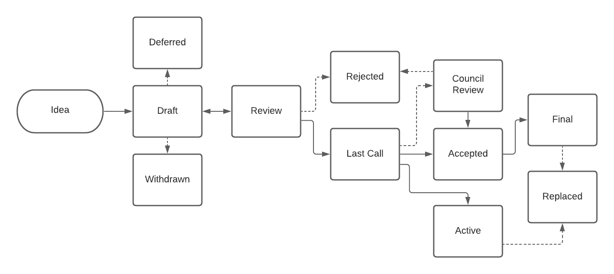
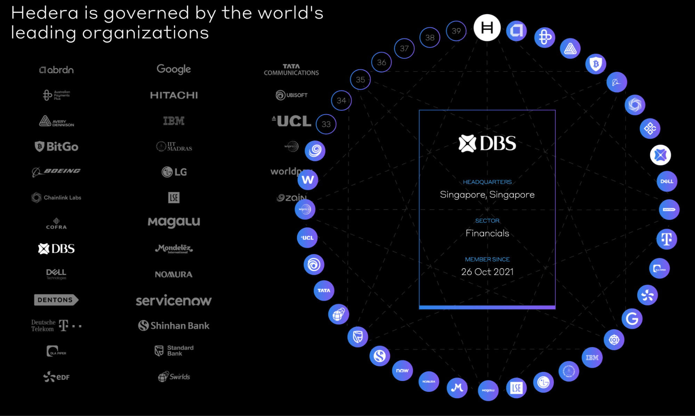
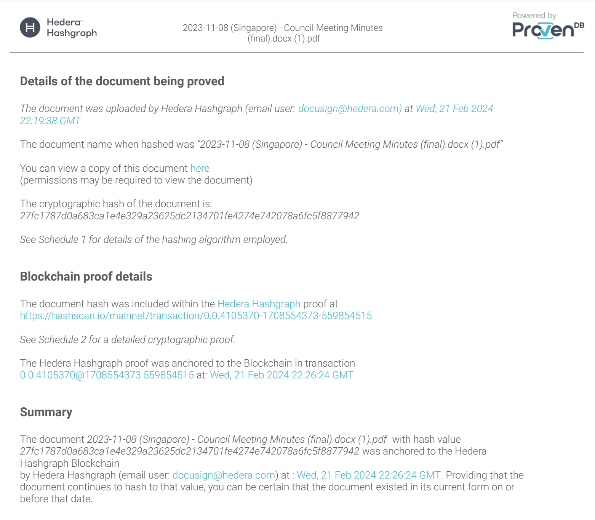
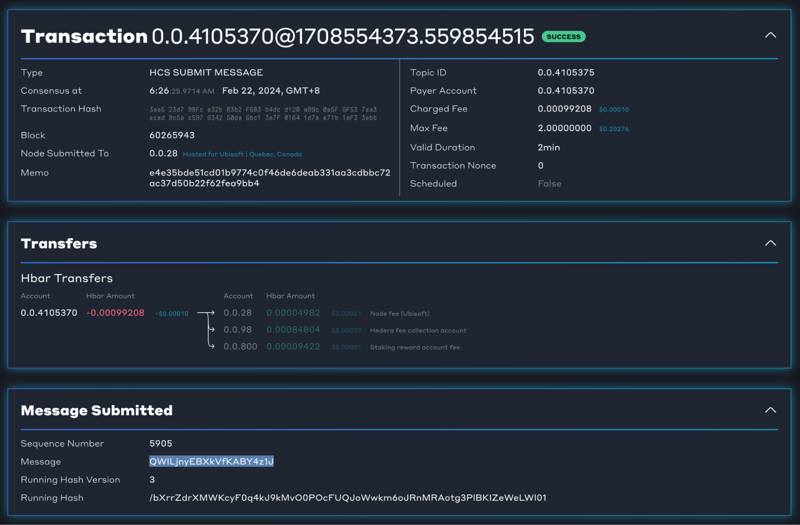
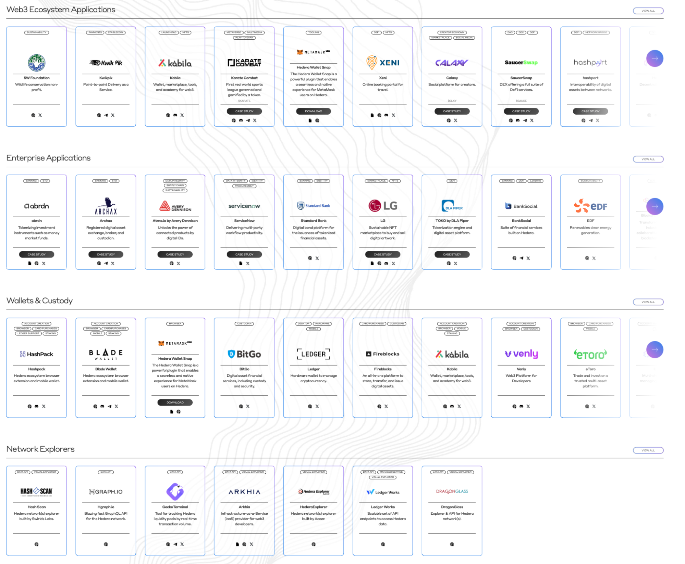
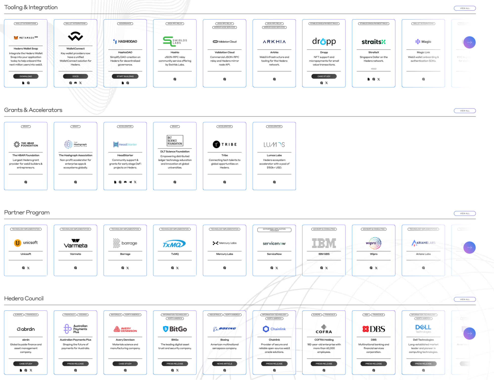

# ***Hedera Ecosystem***

# HIPs

[Hedera Improvement Proposals](https://hips.hedera.com/)
(HIPs) are a collection of proposed changes to the Hedera network, which encompass “standards”, “informational”, and “process” categories. No network is static over its lifetime, and Hedera is no different. Changes and improvements should be made to the network over time, but they should not be proposed unilaterally, instead they should have community input and discussion to achieve a better outcome.

The end-to-end process of a HIP from idea through to implementation is described by the following flow chart:

Note that HIPs are to Hedera as [EIPs](https://eips.ethereum.org/) are to Ethereum.

See also: [About HIPs](https://hips.hedera.com/about-hips)
and [HIPs Process](https://hips.hedera.com/hip/hip-1).

# Governing Council

The Hedera network is neither run by a single company, nor is it run by everyone - it is somewhere in between: Its governance structure comprises a council of up to 39 member organisations

Each of them makes decisions about the future of the network: Technology, product, use cases, treasury, coin economics, government affairs, marketing, council membership. For example, the technology committee would make decisions on HIPs to approve or deny their addition to the product roadmap.

Each of them also is responsible for running Hedera network nodes, which run the Hedera software that processes transactions submitted to the network.  Recall that Hedera is a public permissioned network? The council members are the permissioned parties for running the network.

▶️ [https://www.youtube.com/watch?v=0B205zlTcm4](https://www.youtube.com/watch?v=0B205zlTcm4)

See also: [Hedera council members](https://hedera.com/council)
and [Hedera roadmap](https://hedera.com/roadmap).

The Hedera council uses Hedera’s own technology to provide transparent and verifiable proof of its governance activities, using HCS. Here’s how:

- The [Hedera council minutes](https://hedera.com/council/minutes) are displayed on the main website.

- The meeting minutes are [digitally notarised using ProvenDB](https://files.hedera.com/2023-11-08-Singapore-Council-Meeting-Minutes-final.docx-1_proof.pdf)
- 
- Proven DB, in takes the notarised document’s cryptographic hash, and [adds it to HCS](https://hashscan.io/mainnet/transaction/0.0.4105370-1708554373-559854515).
- 

Therefore, anyone who wants to independently verify the meeting minutes can do so using standard cryptographic libraries.

# SDKs

There are multiple ways to interact with the Hedera network: Hedera APIs, Mirror Node APIs, and JSON-RPC. See the “Talking to Hedera” section above for more details.

Hedera APIs (HAPIs) use [gRPC](https://grpc.io/) as a network protocol
and [protocol buffers](https://github.com/hashgraph/pbj) as a message format. This is technically possible for a developer to use, but it can be quite tedious. The SDKs provide a solution for this, providing an easy to use API that wraps around the low-level complexities of gRPC and protocol buffers.

Hedera SDKs come in multiple programming languages: Java, Javascript, and Go.

[Hedera Javascript SDK Reference Docs](https://hashgraph.github.io/hedera-sdk-js/)

[Hedera Java SDK Reference Docs](https://hashgraph.github.io/hedera-sdk-java/)

[Hedera Go SDK Reference Docs](https://pkg.go.dev/github.com/hashgraph/hedera-sdk-go/v2%23section-documentation)

Note that the Hedera SDK is also available in C++, Rust, and Swift, but these are less mature, and should be considered as “incubating”.

See also: [Hedera SDKs](https://docs.hedera.com/hedera/sdks-and-apis/sdks%23hedera-services-code-sdks).

# Ecosystem Projects

Hedera’s unique capabilities as a blockchain, which can do everything that is possible on EVM, and then some, has allowed a very rich ecosystem of applications to flourish. This spans everything from finance and sustainability to tooling and data.

Explore the projects seen in [Hedera Ecosystem](https://hedera.com/ecosystem).

If you’re looking to get inspired as a developer, we recommend checking out the projects in the [Tooling & Integration](https://hedera.com/ecosystem/integrations)
and [Web3 Applications](https://hedera.com/ecosystem/web3) categories.
